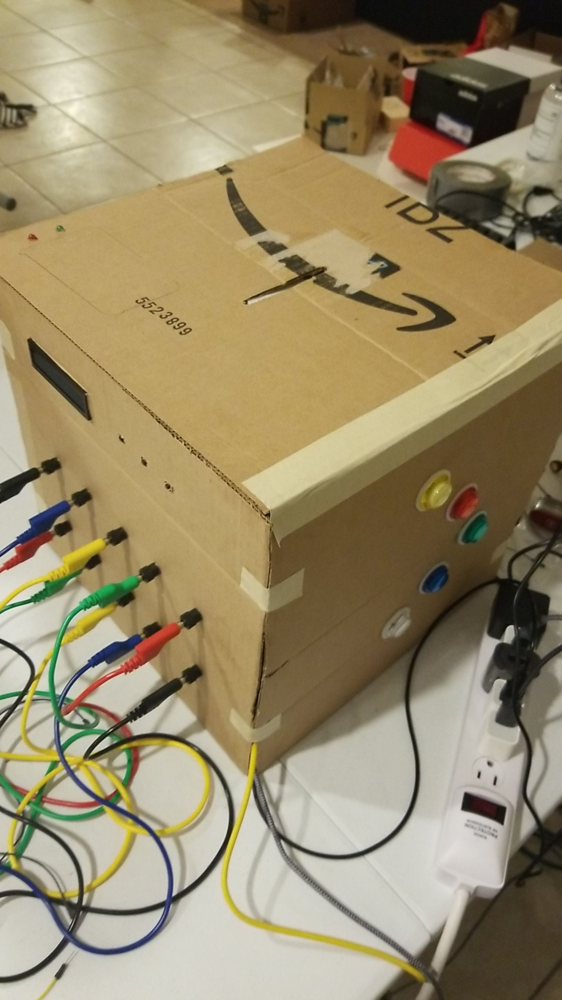
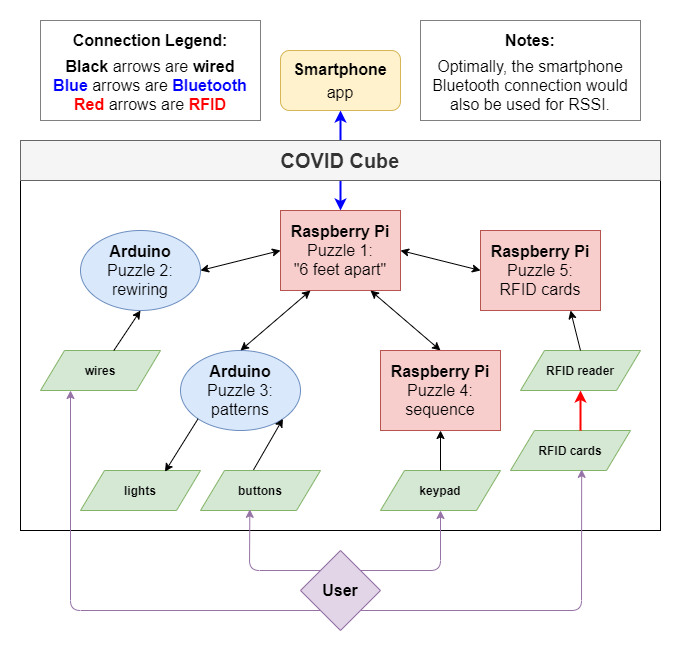
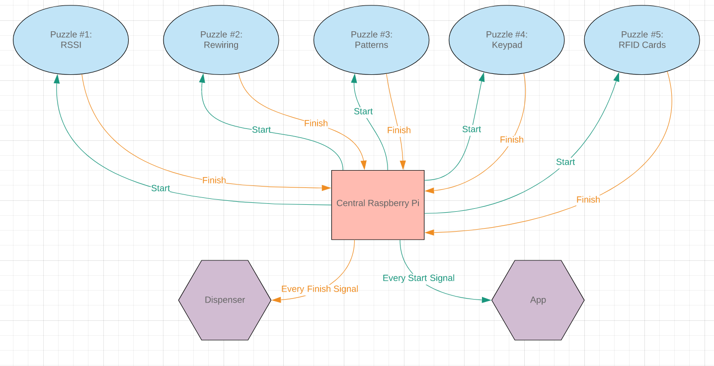
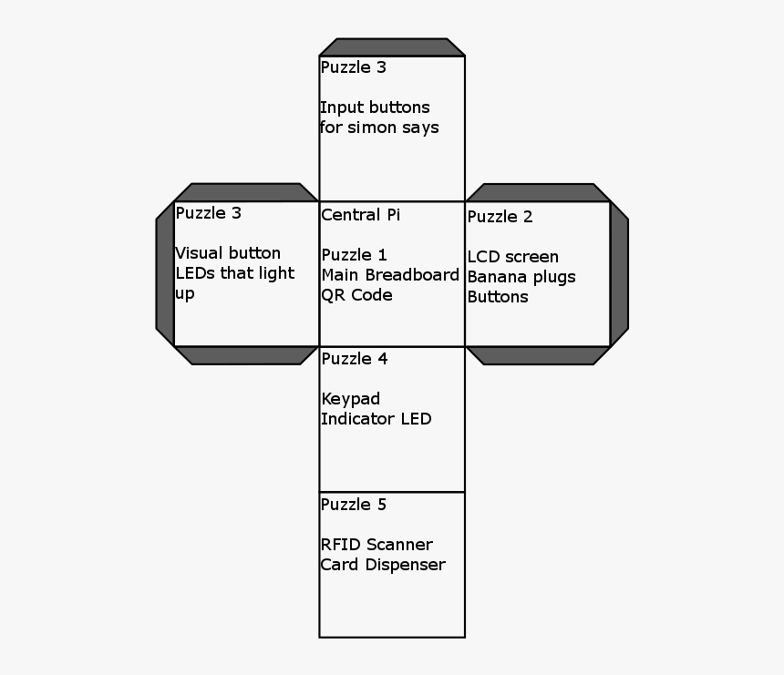
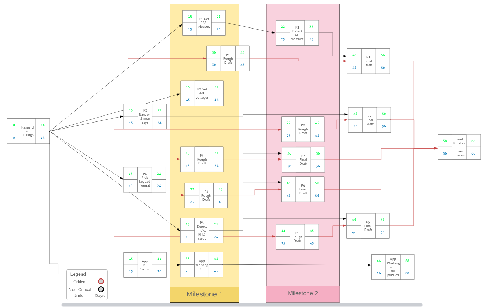

# Covid Puzzle Cube

  

The Covid Puzzle Cube is an educational and fun puzzle box that serves to teach the user about quarantine etiquette. View the live demonstration of the cube [here](https://www.youtube.com/watch?v=7beyGCJO7LQ)!

## Overview

This project was designed over the course of 8 weeks and built in 2 weeks as part of CS179J: Embedded Systems Senior Design, with a team of 5 members at UC Riverside. The Covid Puzzle Cube has 5 puzzles that all interact with each other and share data with a corresponding mobile app. The **full final report** is viewable [here](resources/Final_Report.pdf) with **in depth design and testing information**. This project was written using a combination of Python and CSS, the card dispenser was 3D printed.

## Flowcharts & Diagrams

  
  
A system diagram of how all the devices are laid. Also includes each subsystems input and output signals.

   
   

  
  
A diagram describing how signals will be sent from each subsystem.

   
   

  
  
Physical diagram describing how the box will physically be laid out.

   
   

  
  
Gantt Chart describing how long each subsystem would take to complete and test.

   
   

## Future Developments

If we are to continue development on this project we would like to clean up the exterior with 3D printed exterior parts, and to give the cube a portable power source so it is more easily movable.
